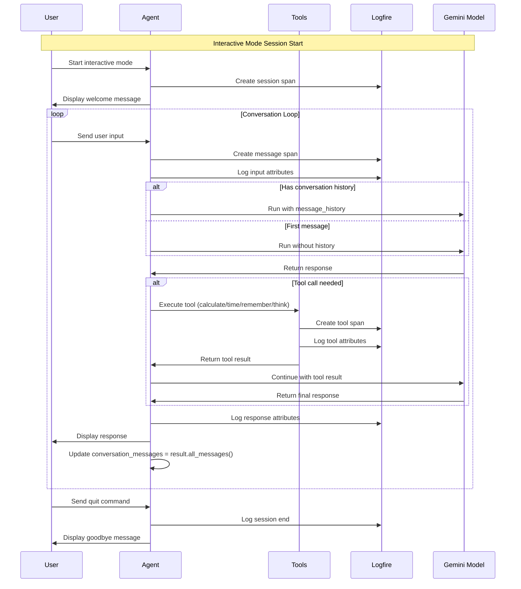
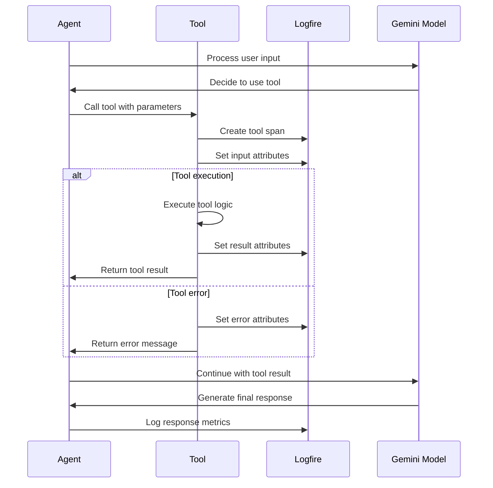

# Small Agents

A collection of AI agents built with `pydantic_ai` framework, demonstrating various capabilities from weather forecasting to interactive chat.

## 🚀 Quick Start

### Prerequisites
- Python 3.8+
- Virtual environment (recommended)

### Installation
```bash
# Clone the repository
git clone <repository-url>
cd small-agents

# Create and activate virtual environment
python -m venv venv
source venv/bin/activate  # On Windows: venv\Scripts\activate

# Install dependencies
pip install pydantic-ai logfire httpx python-dotenv devtools
```

### Environment Setup
Create a `.env` file in the root directory:
```env
# Optional: For weather agent
WEATHER_API_KEY=your_tomorrow_io_api_key
GEO_API_KEY=your_geocode_api_key

# Optional: For logfire monitoring
LOGFIRE_TOKEN=your_logfire_token
```

## 🤖 Agents Overview

### 1. Weather Agent (`src/01_weather_agent.py`)
- **Purpose**: Get real-time weather information for multiple locations
- **Features**: 
  - Geocoding support
  - Multi-location weather data
  - Trip planning with weather insights
- **Usage**: `python src/01_weather_agent.py`

### 2. Research Agent (`src/02_research_agent.py`)
- **Purpose**: Research and information gathering
- **Status**: In development

### 3. Tic Tac Toe Agent (`src/03_tick_tock_agent.py`)
- **Purpose**: Play Tic Tac Toe with AI
- **Features**: Two-player game simulation
- **Usage**: `python src/03_tick_tock_agent.py`

### 4. General Chat Agent (`src/04_general_chat_agent.py`) ⭐
- **Purpose**: Interactive conversational AI assistant
- **Features**:
  - Casual conversations
  - User information memory
  - Mathematical calculations
  - Current time queries
  - Step-by-step problem solving
- **Usage**: 
  ```bash
  # Demo mode
  python src/04_general_chat_agent.py
  
  # Interactive mode
  python src/04_general_chat_agent.py --interactive
  ```

### 5. Reinforcement Learning - Frozen Lake DQN (`rl-games/frozen_lake_dqn.py`)
- **Purpose**: Deep Q-Network implementation for the Frozen Lake environment
- **Features**:
  - Neural network-based Q-learning
  - Experience replay buffer
  - Target network for stability
  - Epsilon-greedy exploration strategy
- **Usage**: `python rl-games/frozen_lake_dqn.py`

## 🧠 Reinforcement Learning - Frozen Lake DQN Algorithm

### Deep Q-Network (DQN) Algorithm Steps

The Frozen Lake DQN implementation demonstrates a complete reinforcement learning solution using neural networks to learn optimal navigation policies.

#### **Step 1: Environment Setup**
- Create a 4x4 Frozen Lake grid where the agent (S) must navigate from start to goal (G)
- States: 16 possible positions (0-15), Actions: 4 directions (Left, Down, Right, Up)
- Rewards: +1 for reaching goal, 0 for falling in holes or other actions

#### **Step 2: Neural Network Architecture**
- **Policy Network**: Takes current state as input, outputs Q-values for all 4 actions
- **Target Network**: Copy of policy network (updated less frequently for stability)
- Architecture: Input layer (16 nodes) → Hidden layer (16 nodes, ReLU) → Output layer (4 nodes)

#### **Step 3: Experience Replay Buffer**
- Store experiences as (state, action, reward, next_state, done) tuples
- Randomly sample batches of experiences for training (prevents correlation issues)
- Buffer size: 1000 experiences, Batch size: 32

#### **Step 4: Action Selection (Epsilon-Greedy)**
- **Exploration**: With probability ε (epsilon), choose random action
- **Exploitation**: With probability (1-ε), choose action with highest Q-value
- Start with ε = 1.0 (100% random), gradually decay to ε = 0.01

#### **Step 5: Experience Collection**
- Execute selected action in environment
- Observe new state, reward, and whether episode ended
- Store experience in replay buffer
- Continue until episode terminates (goal reached or hole fallen)

#### **Step 6: Q-Learning Update**
- Sample random batch from replay buffer
- For each experience, calculate target Q-value:
  - **If terminated**: Target = reward
  - **If not terminated**: Target = reward + γ × max(Q(next_state))
- γ (gamma) = 0.9 (discount factor for future rewards)

#### **Step 7: Neural Network Training**
- Compute loss between current Q-values and target Q-values
- Use Mean Squared Error (MSE) loss function
- Update policy network weights using Adam optimizer
- Learning rate: 0.001

#### **Step 8: Target Network Synchronization**
- Every 10 steps, copy policy network weights to target network
- This prevents the "moving target" problem and stabilizes training

#### **Step 9: Epsilon Decay**
- Gradually reduce exploration rate: ε = max(ε - 1/episodes, 0.01)
- Balance exploration vs exploitation as agent learns

#### **Step 10: Convergence**
- Train for 10,000 episodes
- Agent learns optimal policy to navigate from start to goal
- Save trained model and visualize learning progress

### Key Innovations
The key innovation of DQN is using a neural network to approximate Q-values instead of a lookup table, allowing it to handle large state spaces efficiently while using experience replay and target networks to ensure stable learning.

### Files Generated
- `frozen_lake_dql.pt`: Trained neural network model
- `frozen_lake_dql.png`: Learning progress visualization (rewards and epsilon decay)

## 🎯 General Chat Agent Deep Dive

### Features
- **Conversation Memory**: Maintains context across the entire session
- **Tool Integration**: Built-in tools for calculations, time, and user info
- **Interactive Mode**: Real-time conversation with command support
- **Logging**: Comprehensive logfire integration for monitoring

### Sequence Diagram



### Tool Execution Flow



### Tools Available
1. **`remember_user_info`**: Store user name and interests
2. **`get_current_time`**: Get current date and time
3. **`calculate_simple`**: Perform basic mathematical operations
4. **`get_thinking`**: Step-by-step problem analysis

### Usage Examples

#### Demo Mode
```bash
python src/04_general_chat_agent.py
```
Runs predefined conversations showcasing all agent capabilities.

#### Interactive Mode
```bash
python src/04_general_chat_agent.py --interactive
```

**Available Commands:**
- `help` - Show available commands
- `quit`, `exit`, `bye` - End conversation
- Any other input - Chat with the agent

**Example Conversation:**
```
👤 You: Hi! My name is Alice and I love reading.
🤖 Assistant: Nice to meet you, Alice! I'll remember that you enjoy reading.

👤 You: What do you remember about me?
🤖 Assistant: I remember that your name is Alice and you love reading!

👤 You: Can you calculate 15 * 7 + 23?
🤖 Assistant: The answer is 128.

👤 You: What time is it right now?
🤖 Assistant: The current time is 2025-07-01 14:30:00.
```

## 📊 Monitoring & Logging

All agents use **logfire** for comprehensive monitoring:

### Logfire Features
- **Automatic HTTP request logging** (when AsyncClient is used)
- **Tool execution spans** with detailed attributes
- **Conversation session tracking**
- **Performance metrics** (response times, token usage)
- **Error tracking** and debugging information

### Logfire Configuration
```python
# Configure logfire (sends data only if token is present)
logfire.configure(send_to_logfire='if-token-present')
logfire.instrument_pydantic_ai()
```

## 🏗️ Architecture

### Agent Structure
Each agent follows a consistent pattern:
1. **Dependencies**: External APIs, clients, configuration
2. **Tools**: Specialized functions with `@agent.tool` decorator
3. **Agent Configuration**: Model, system prompt, output types
4. **Main Logic**: Async execution with proper error handling

### Key Components
- **`pydantic_ai.Agent`**: Core agent framework
- **`httpx.AsyncClient`**: Asynchronous HTTP client
- **`logfire`**: Observability and monitoring
- **`pydantic.BaseModel`**: Data validation and serialization

## 🔧 Development

### Adding New Tools
```python
@agent.tool
async def my_new_tool(ctx: RunContext, param: str) -> str:
    """Tool description."""
    with logfire.span("my_new_tool") as span:
        # Tool logic here
        span.set_attribute("result", "success")
        return "Tool result"
```

### Adding New Agents
1. Create new file in `src/` directory
2. Follow the established pattern from existing agents
3. Add proper logging and error handling
4. Update this README with documentation

## 📈 Performance

### Optimization Tips
- Use `AsyncClient` for concurrent HTTP requests
- Implement proper error handling with `ModelRetry`
- Use logfire spans for performance monitoring
- Leverage conversation memory for context-aware responses

### Monitoring Metrics
- Response times per tool
- Token usage and costs
- Error rates and types
- User interaction patterns

## 🤝 Contributing

1. Fork the repository
2. Create a feature branch
3. Add your agent or improvements
4. Include proper documentation
5. Submit a pull request

## 📄 License

This project is licensed under the MIT License - see the LICENSE file for details.

## 🙏 Acknowledgments

- **pydantic_ai**: AI agent framework
- **logfire**: Observability platform
- **httpx**: Async HTTP client
- **Gemini 2.0 Flash**: AI model powering the agents 