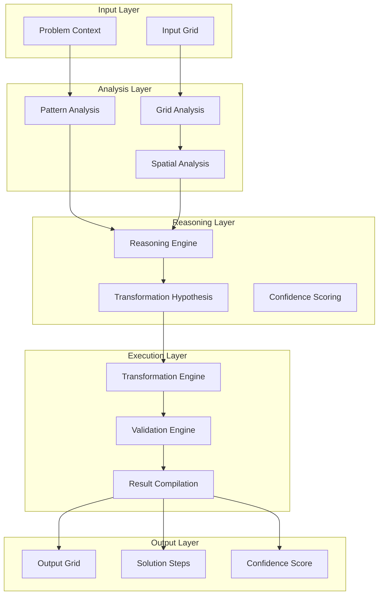
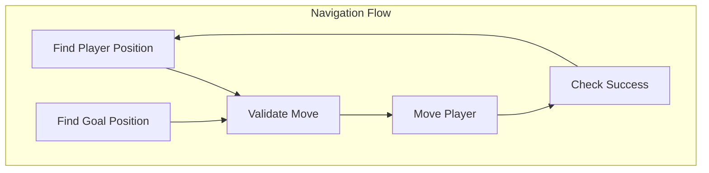
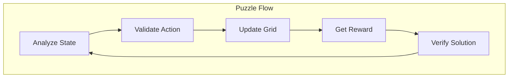
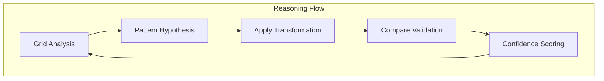
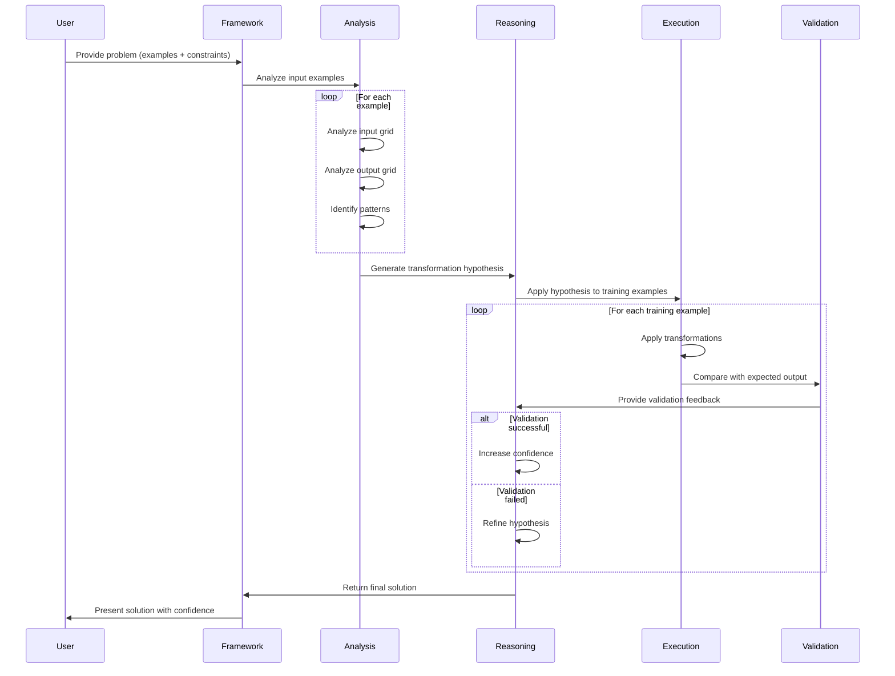

# Grid Game Framework Architecture

## Overview
The Grid Game Framework provides **three distinct patterns** for solving grid-based problems using AI agents. Each pattern is optimized for different types of problems and can be applied across various domains including navigation, puzzle solving, and visual reasoning.

## Pattern Classification

### 1. Navigation & Pathfinding Pattern
**Domain**: Navigation games, pathfinding, exploration problems  
**Examples**: Frozen Lake, Maze navigation, Robot pathfinding  
**Key Focus**: Position tracking, obstacle avoidance, goal reaching

### 2. Puzzle Solving & State Transformation Pattern  
**Domain**: Logic puzzles, state-based games, transformation problems  
**Examples**: Sokoban, Sliding puzzles, State machines  
**Key Focus**: Rule validation, state transformation, progress tracking

### 3. Visual Reasoning & Pattern Recognition Pattern
**Domain**: Visual puzzles, pattern matching, abstract reasoning  
**Examples**: ARC challenges, Image transformations, Pattern completion  
**Key Focus**: Pattern analysis, geometric transformations, validation

## Core Architecture



## Pattern-Specific Architectures

### Pattern 1: Navigation & Pathfinding



**Key Components**:
- **Position Tracking**: Maintain current agent position
- **Goal Detection**: Identify target destination
- **Path Validation**: Check move legality and safety
- **State Update**: Execute moves and update grid
- **Success Detection**: Determine if goal reached

### Pattern 2: Puzzle Solving & State Transformation



**Key Components**:
- **State Analysis**: Understand current puzzle state
- **Rule Validation**: Check action compliance with game rules
- **State Transformation**: Apply actions and update grid
- **Reward Calculation**: Evaluate action quality and progress
- **Solution Verification**: Check if puzzle is solved

### Pattern 3: Visual Reasoning & Pattern Recognition



**Key Components**:
- **Pattern Analysis**: Identify geometric and value patterns
- **Transformation DSL**: Apply geometric operations
- **Validation Engine**: Compare results with expectations
- **Confidence Scoring**: Assess solution reliability

## Component Details

### 1. Input Layer
**Purpose**: Accept and validate input data

```python
class GridInput:
    grid: List[List[int]]  # 2D grid representation
    context: Dict[str, Any]  # Problem-specific context
    constraints: List[str]  # Problem constraints
```

### 2. Analysis Layer
**Purpose**: Understand the structure and patterns in the grid

#### Grid Analysis
```python
class GridAnalysis:
    grid_shape: List[int]  # [rows, cols]
    unique_values: List[int]  # Distinct values in grid
    value_counts: Dict[str, int]  # Frequency of each value
    pattern_description: str  # Human-readable pattern description
```

#### Pattern Analysis
- **Geometric Patterns**: Rotation, reflection, translation
- **Value Patterns**: Replacement, arithmetic operations
- **Structural Patterns**: Tiling, borders, cropping

#### Spatial Analysis
- **Position Analysis**: Relative positions of elements
- **Connectivity Analysis**: Connected components
- **Boundary Analysis**: Edge and corner patterns

### 3. Reasoning Layer
**Purpose**: Generate hypotheses about transformations

#### Reasoning Engine
```python
class ReasoningEngine:
    def analyze_patterns(self, examples: List[GridPair]) -> List[TransformationHypothesis]:
        """Analyze training examples to identify patterns."""
        
    def generate_hypothesis(self, patterns: List[Pattern]) -> TransformationHypothesis:
        """Generate transformation hypothesis from patterns."""
        
    def refine_hypothesis(self, hypothesis: TransformationHypothesis, feedback: ValidationResult) -> TransformationHypothesis:
        """Refine hypothesis based on validation feedback."""
```

#### Transformation Hypothesis
```python
class TransformationHypothesis:
    operations: List[Operation]  # Sequence of operations
    confidence: float  # Confidence in hypothesis
    reasoning: str  # Explanation of hypothesis
    validation_results: List[ValidationResult]  # Results on training examples
```

### 4. Execution Layer
**Purpose**: Apply transformations and validate results

#### Transformation Engine
```python
class TransformationEngine:
    def apply_transformation(self, grid: List[List[int]], operation: Operation) -> List[List[int]]:
        """Apply a single transformation operation."""
        
    def apply_sequence(self, grid: List[List[int]], operations: List[Operation]) -> List[List[int]]:
        """Apply a sequence of transformations."""
        
    def validate_operation(self, operation: Operation, grid: List[List[int]]) -> bool:
        """Validate if operation can be applied to grid."""
```

#### Validation Engine
```python
class ValidationEngine:
    def compare_grids(self, actual: List[List[int]], expected: List[List[int]]) -> ValidationResult:
        """Compare actual result with expected result."""
        
    def calculate_similarity(self, grid1: List[List[int]], grid2: List[List[int]]) -> float:
        """Calculate similarity between two grids."""
        
    def validate_constraints(self, grid: List[List[int]], constraints: List[str]) -> bool:
        """Validate grid against problem constraints."""
```

### 5. Output Layer
**Purpose**: Present results in a structured format

```python
class GridSolution:
    input_grid: List[List[int]]
    output_grid: List[List[int]]
    transformation_steps: List[TransformationStep]
    confidence: float
    reasoning: str
    validation_metrics: Dict[str, float]
```

## Domain-Specific Language (DSL)

### Geometric Operations
```python
DSL = {
    "rotate_90": lambda grid: np.rot90(grid, k=1),
    "rotate_180": lambda grid: np.rot90(grid, k=2),
    "rotate_270": lambda grid: np.rot90(grid, k=3),
    "flip_horizontal": lambda grid: np.fliplr(grid),
    "flip_vertical": lambda grid: np.flipud(grid),
    "transpose": lambda grid: np.transpose(grid),
}
```

### Value Operations
```python
DSL.update({
    "replace_values": lambda grid, old_val, new_val: np.where(grid == old_val, new_val, grid),
    "add_constant": lambda grid, constant: grid + constant,
    "multiply_by": lambda grid, factor: grid * factor,
    "modulo": lambda grid, divisor: grid % divisor,
})
```

### Structural Operations
```python
DSL.update({
    "add_border": lambda grid, border_val=0: np.pad(grid, 1, mode='constant', constant_values=border_val),
    "remove_border": lambda grid: grid[1:-1, 1:-1],
    "tile_grid": lambda grid, factor=2: np.tile(grid, (factor, factor)),
    "crop_grid": lambda grid, start_row, end_row, start_col, end_col: grid[start_row:end_row, start_col:end_col],
})
```

## Problem-Solving Workflow



## Confidence Scoring System

### Factors Considered
1. **Training Accuracy**: Percentage of training examples solved correctly
2. **Pattern Consistency**: How well the pattern generalizes across examples
3. **Transformation Complexity**: Number and complexity of operations required
4. **Validation Robustness**: Consistency of results across multiple runs

### Scoring Algorithm
```python
def calculate_confidence(self, solution: GridSolution) -> float:
    training_accuracy = self.calculate_training_accuracy(solution)
    pattern_consistency = self.calculate_pattern_consistency(solution)
    complexity_penalty = self.calculate_complexity_penalty(solution)
    
    confidence = (training_accuracy * 0.6 + 
                  pattern_consistency * 0.3 - 
                  complexity_penalty * 0.1)
    
    return max(0.0, min(1.0, confidence))
```

## Implementation Examples & Learnings

### Frozen Lake Navigation Pattern

**Key Implementation Details**:
```python
# Position tracking with coordinate systems
@agent.tool
async def find_player_position(ctx: RunContext, grid: List[List[str]]) -> tuple:
    """Find player position (P) in the grid"""
    for i, row in enumerate(grid):
        for j, cell in enumerate(row):
            if cell == 'P':
                return (i, j)
    return None

# Boundary validation
@agent.tool
async def validate_move(ctx: RunContext, from_pos: tuple, action: str) -> MoveValidation:
    """Check if move is valid and safe"""
    new_x, new_y = calculate_new_position(from_pos, action)
    
    # Check bounds
    if new_x < 0 or new_x >= grid_size or new_y < 0 or new_y >= grid_size:
        return MoveValidation(valid=False, reason="Out of bounds")
    
    # Check for obstacles
    if grid[new_x][new_y] == 'H':  # Hole
        return MoveValidation(valid=False, reason="Hole detected")
    
    return MoveValidation(valid=True, new_position=(new_x, new_y))
```

**Key Learnings**:
- **Coordinate Consistency**: Always specify 1-based vs 0-based indexing
- **Boundary Checking**: Validate moves before execution
- **State Visualization**: Pretty-print grids for debugging
- **Reward Shaping**: Use meaningful rewards (-1000 for holes, +100 for goal)

### Sokoban Puzzle Solving Pattern

**Key Implementation Details**:
```python
# State transformation with deep copying
@agent.tool
async def update_grid(ctx: RunContext, grid: List[List[str]], action: Action) -> List[List[str]]:
    """Update grid based on valid action"""
    # Create deep copy to avoid mutation
    new_grid = [row[:] for row in grid]
    
    # Calculate new positions
    new_player_pos = calculate_new_position(player_pos, action)
    
    # Handle complex interactions (box pushing)
    if new_grid[new_player_pos[0]][new_player_pos[1]] in ['X', '√']:
        box_new_pos = calculate_box_new_position(new_player_pos, action)
        # Validate box movement
        if not is_valid_box_move(box_new_pos, new_grid):
            return grid  # Return unchanged grid
    
    # Update grid state
    update_player_position(new_grid, new_player_pos)
    return new_grid

# Dynamic reward calculation
@agent.tool
async def get_reward(ctx: RunContext, state: str, action: Action) -> float:
    """Calculate reward considering progress and deadlocks"""
    reward = 0.0
    
    # Progress reward
    boxes_on_targets = count_boxes_on_targets(state)
    reward += boxes_on_targets * 10.0
    
    # Deadlock penalty
    if is_deadlock_position(state):
        reward -= 20.0
    
    # Move penalty
    reward -= 1.0
    
    return reward
```

**Key Learnings**:
- **State Immutability**: Use deep copies to prevent side effects
- **Complex Rule Validation**: Handle edge cases like box pushing
- **Dynamic Rewards**: Consider progress, deadlocks, and efficiency
- **Restart Mechanisms**: Reset to original state when stuck
- **Prompt Versioning**: Use different prompts for different complexities

### ARC Visual Reasoning Pattern

**Key Implementation Details**:
```python
# Pattern analysis with structured output
@agent.tool
async def analyze_grid(ctx: RunContext, grid: List[List[int]], name: str = "grid") -> GridAnalysis:
    """Analyze grid structure and patterns"""
    return GridAnalysis(
        grid_shape=[len(grid), len(grid[0])],
        unique_values=list(set(val for row in grid for val in row)),
        value_counts=count_values(grid),
        pattern_description=describe_patterns(grid)
    )

# Transformation DSL
@agent.tool
async def apply_transformation(ctx: RunContext, grid: List[List[int]], operation: str, **params) -> List[List[int]]:
    """Apply geometric or value transformations"""
    if operation == "rotate_90":
        return np.rot90(grid, k=1).tolist()
    elif operation == "replace_values":
        return np.where(grid == params["old_value"], params["new_value"], grid).tolist()
    # ... more operations
```

**Key Learnings**:
- **Structured Analysis**: Return comprehensive grid analysis
- **Transformation DSL**: Provide reusable geometric operations
- **Confidence Scoring**: Self-assess solution reliability
- **Multi-example Learning**: Use training examples to generalize

## Extensibility Patterns

### Adding New Operations
```python
def custom_operation(grid: np.ndarray, **params) -> np.ndarray:
    """Custom grid transformation operation."""
    # Implementation here
    return transformed_grid

# Register with DSL
DSL["custom_operation"] = custom_operation
```

### Adding New Analysis Types
```python
class CustomAnalysis:
    def analyze(self, grid: np.ndarray) -> Dict[str, Any]:
        """Custom grid analysis."""
        # Implementation here
        return analysis_result

# Register with analysis pipeline
ANALYSIS_TYPES.append(CustomAnalysis)
```

### Adding New Validation Metrics
```python
def custom_validation(actual: np.ndarray, expected: np.ndarray) -> float:
    """Custom validation metric."""
    # Implementation here
    return similarity_score

# Register with validation engine
VALIDATION_METRICS["custom"] = custom_validation
```

## Performance Optimization

### 1. Caching
- **Analysis Results**: Cache grid analysis results
- **Transformation Results**: Cache common transformations
- **Validation Results**: Cache validation comparisons

### 2. Parallelization
- **Example Processing**: Process multiple examples in parallel
- **Transformation Testing**: Test multiple hypotheses concurrently
- **Validation**: Validate multiple results simultaneously

### 3. Early Termination
- **Confidence Thresholds**: Stop when confidence is high enough
- **Failure Detection**: Stop when pattern is clearly wrong
- **Resource Limits**: Stop when time/memory limits are reached

## Error Handling

### 1. Invalid Operations
```python
def safe_apply_transformation(grid: np.ndarray, operation: str, **params) -> np.ndarray:
    try:
        if operation not in DSL:
            raise ValueError(f"Unknown operation: {operation}")
        return DSL[operation](grid, **params)
    except Exception as e:
        logfire.error("Transformation failed", operation=operation, error=str(e))
        raise
```

### 2. Validation Failures
```python
def handle_validation_failure(self, hypothesis: TransformationHypothesis, 
                            failure: ValidationFailure) -> TransformationHypothesis:
    """Handle validation failure by refining hypothesis."""
    if failure.type == "shape_mismatch":
        return self.refine_shape_hypothesis(hypothesis, failure)
    elif failure.type == "value_mismatch":
        return self.refine_value_hypothesis(hypothesis, failure)
    else:
        return self.generate_alternative_hypothesis(hypothesis, failure)
```

## Monitoring and Observability

### Key Metrics
- **Pattern Recognition Time**: Time to identify transformation patterns
- **Transformation Success Rate**: Percentage of successful transformations
- **Validation Accuracy**: Correctness of final solutions
- **Confidence Correlation**: How well confidence scores predict accuracy

### Logging Strategy
```python
with logfire.span("grid_analysis") as span:
    span.set_attribute("grid_shape", grid.shape)
    span.set_attribute("unique_values", len(np.unique(grid)))
    # Analysis logic here
    span.set_attribute("analysis_time", analysis_time)
```

## Best Practices

1. **Modular Design**: Keep components loosely coupled
2. **Extensible DSL**: Make it easy to add new operations
3. **Comprehensive Validation**: Validate at each step
4. **Confidence Scoring**: Always provide confidence estimates
5. **Error Recovery**: Handle failures gracefully
6. **Performance Monitoring**: Track and optimize performance
7. **Documentation**: Document all operations and patterns
8. **Testing**: Test with diverse problem types 