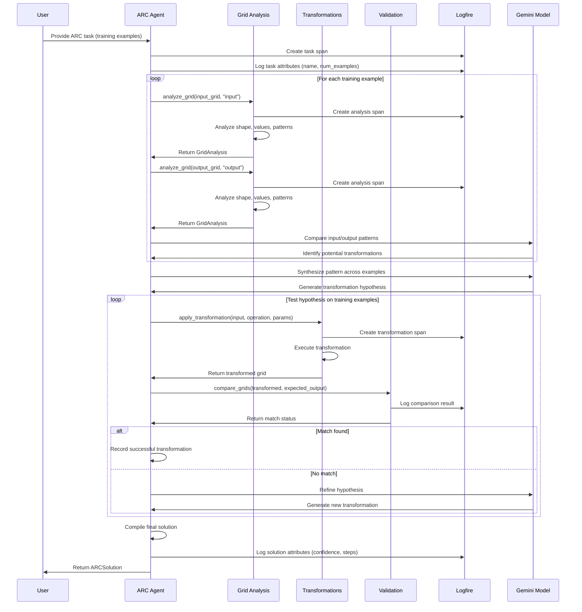
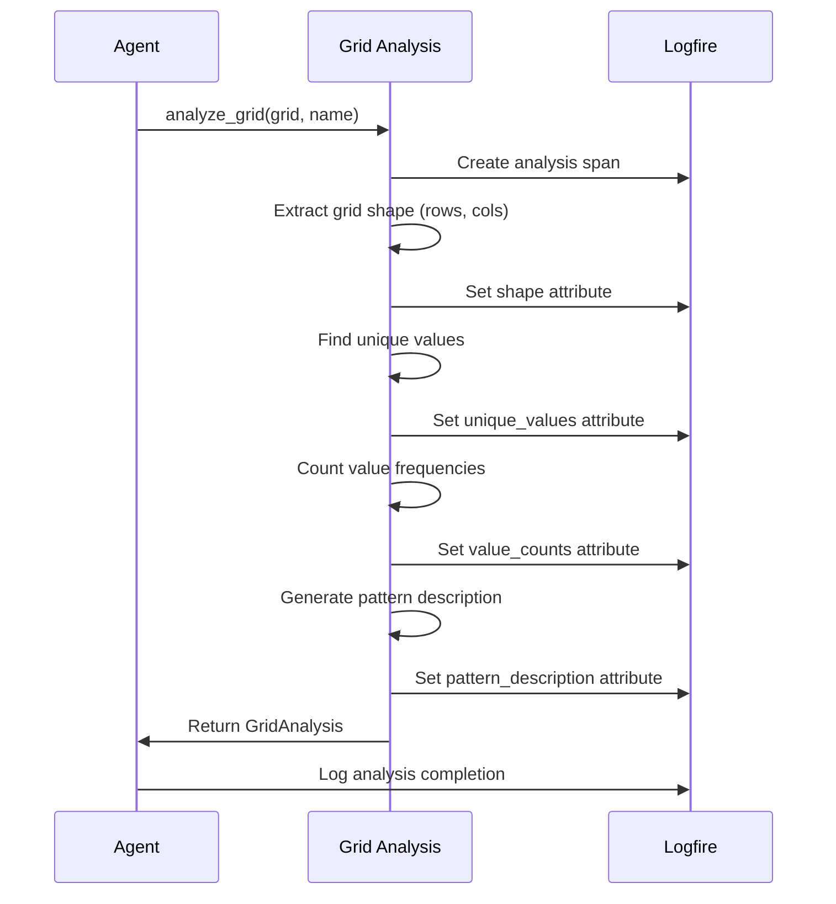
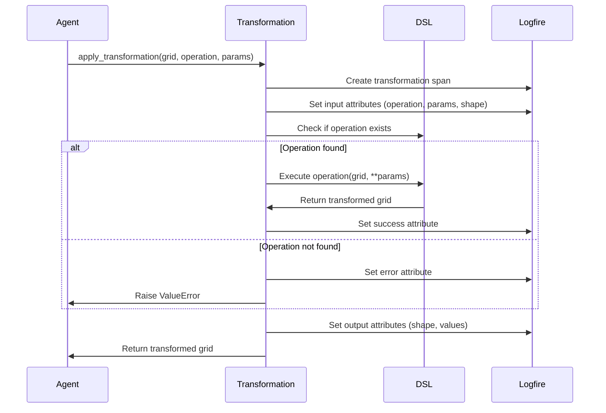
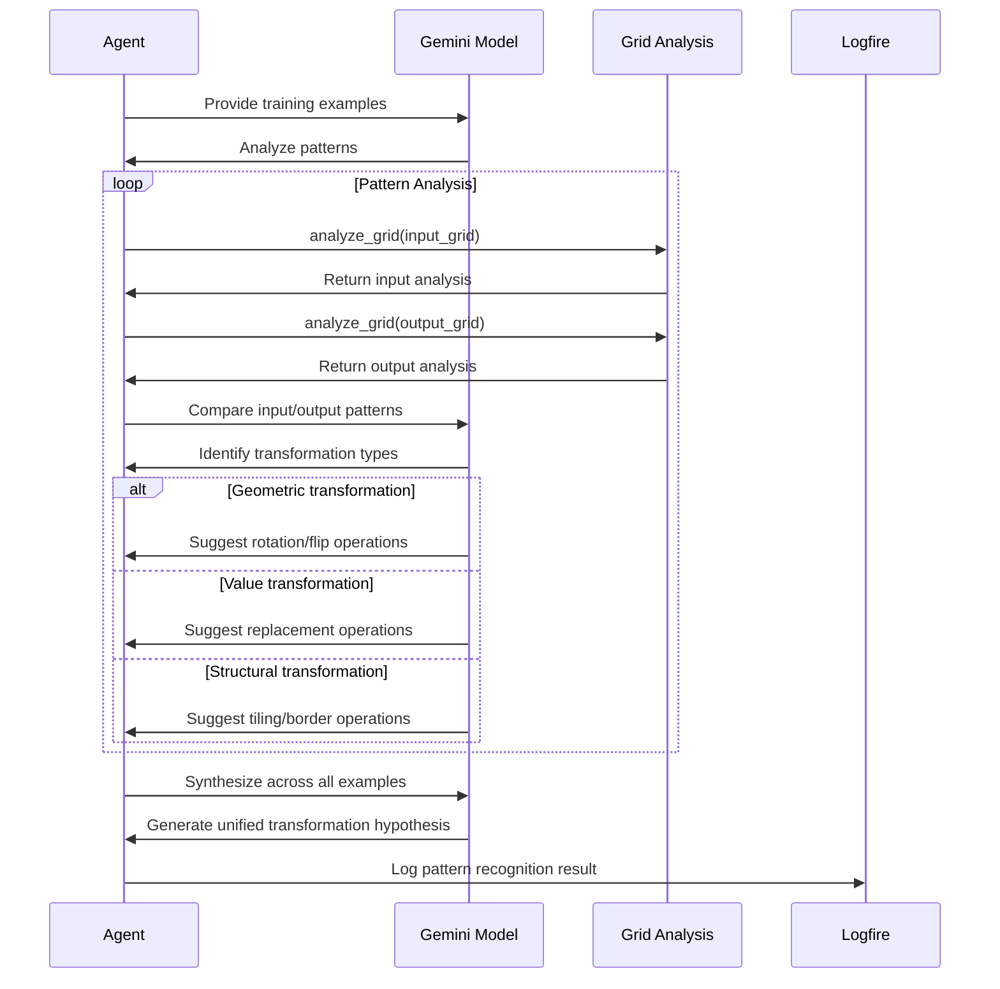
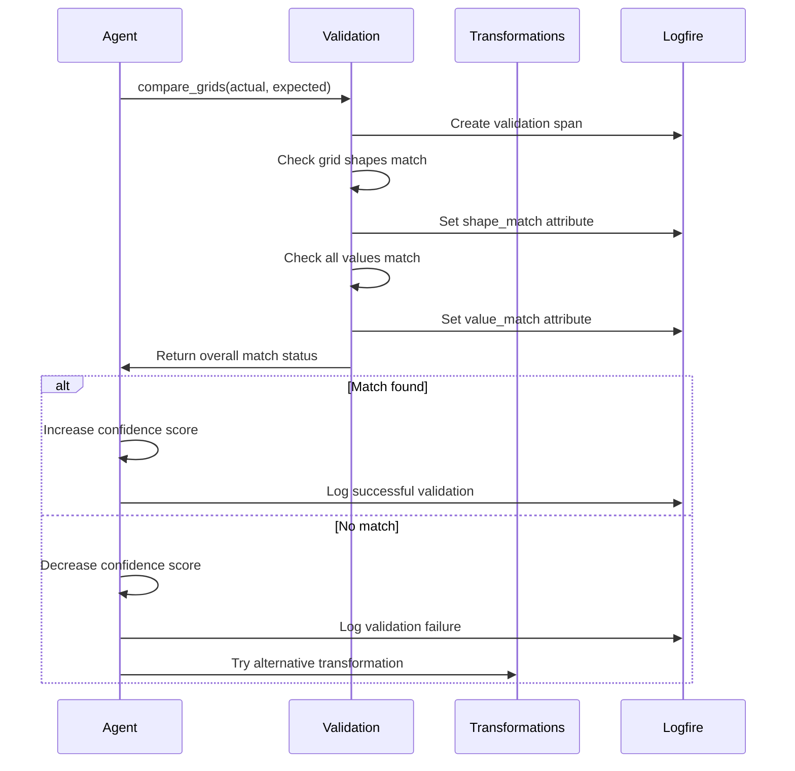
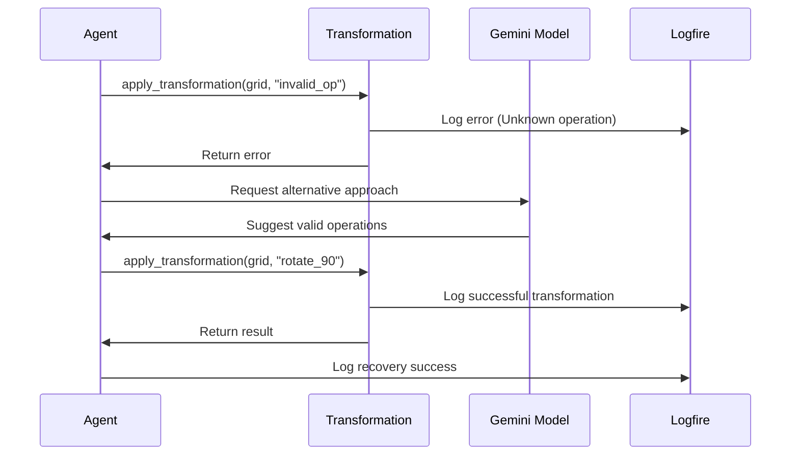

# ARC Agent - Visual Reasoning Process

## Overview
The ARC (Abstraction and Reasoning Corpus) Agent demonstrates advanced visual reasoning capabilities by analyzing grid patterns and applying transformations to solve complex visual puzzles. This document shows the detailed reasoning flow.

## Main Reasoning Flow



## Grid Analysis Process



## Transformation Application



## Pattern Recognition Flow



## Validation and Confidence Scoring



## Error Handling and Recovery



## Key Components

### 1. Domain-Specific Language (DSL)
- **Geometric Operations**: `rotate_90`, `flip_horizontal`, `flip_vertical`
- **Value Operations**: `replace_values`
- **Structural Operations**: `add_border`, `tile_grid`

### 2. Grid Analysis
- **Shape Analysis**: Dimensions and structure
- **Value Analysis**: Unique values and frequencies
- **Pattern Recognition**: Identifying spatial relationships

### 3. Transformation Pipeline
- **Hypothesis Generation**: Based on training examples
- **Application**: Execute transformations step by step
- **Validation**: Compare with expected outputs
- **Refinement**: Adjust approach based on results

### 4. Confidence Scoring
- **Success Rate**: Percentage of training examples solved correctly
- **Pattern Consistency**: How well the pattern generalizes
- **Complexity Assessment**: Number of transformation steps required

## Performance Metrics

- **Pattern Recognition Time**: Time to identify transformation patterns
- **Transformation Success Rate**: Percentage of successful transformations
- **Validation Accuracy**: Correctness of final solutions
- **Confidence Correlation**: How well confidence scores predict accuracy

## Common Patterns

### 1. Rotation Patterns
```
Input:  [1,0]    Output: [0,1]
        [0,1]            [1,0]
```
**Detection**: Compare corner positions, identify rotation angle

### 2. Value Replacement
```
Input:  [1,1,0]  Output: [2,2,0]
```
**Detection**: Analyze value frequency changes

### 3. Tiling Patterns
```
Input:  [1]      Output: [1,1,1]
                 [1,1,1]
                 [1,1,1]
```
**Detection**: Compare input/output size ratios 