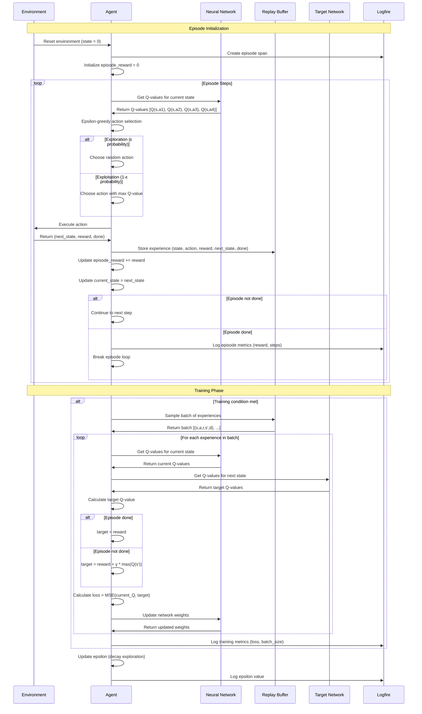
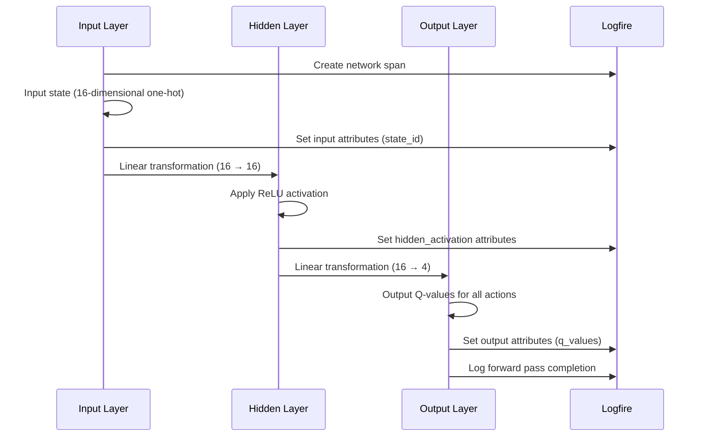
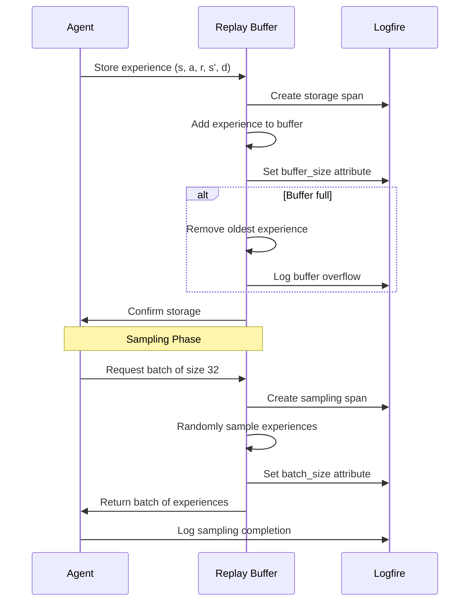
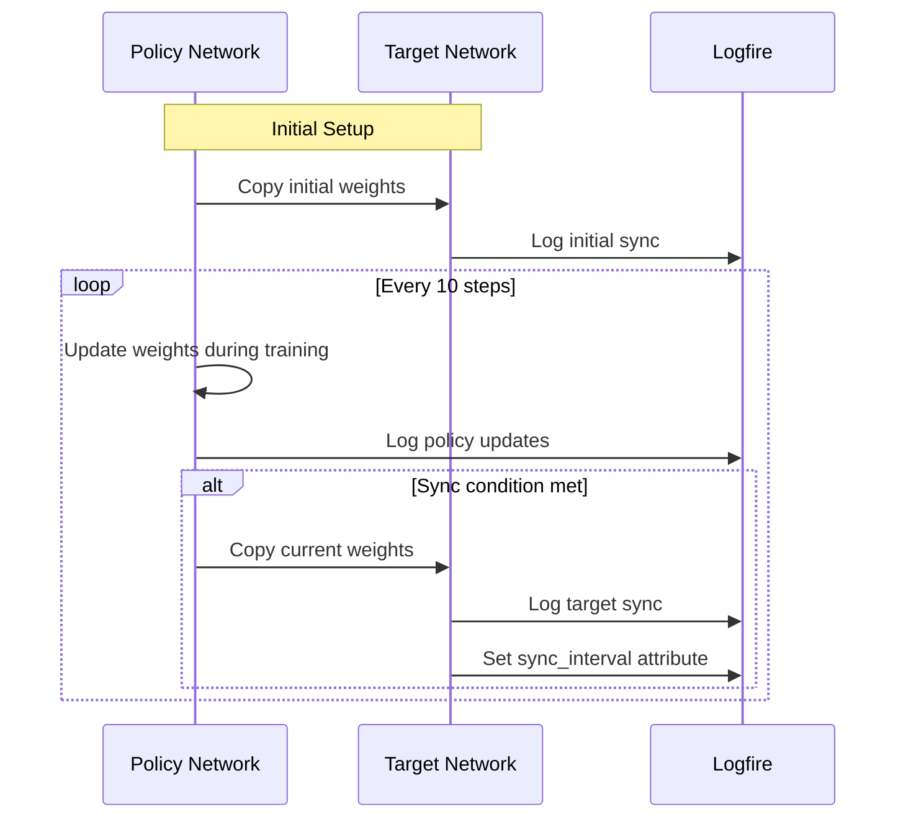
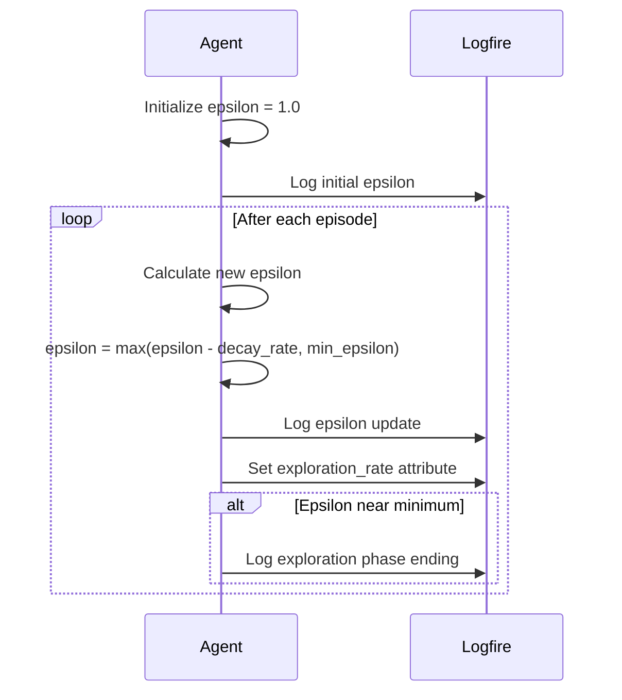
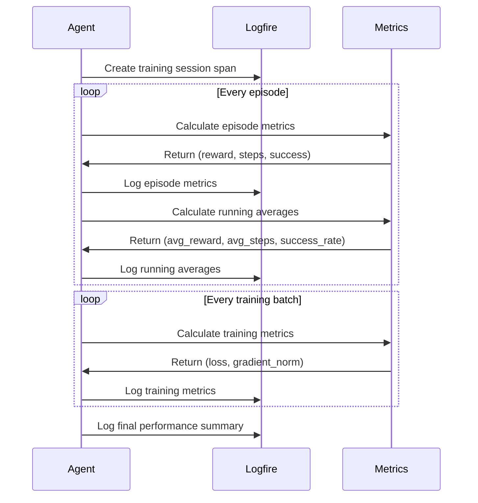

# Frozen Lake - Reinforcement Learning Training Flow

## Overview
The Frozen Lake DQN implementation demonstrates a complete reinforcement learning solution using neural networks to learn optimal navigation policies. This document shows the detailed training flow.

## Main Training Loop

## Neural Network Architecture

## Experience Replay Buffer

## Target Network Synchronization

## Epsilon Decay Strategy

## Performance Monitoring

## Key Components

### 1. Environment
- **State Space**: 16 discrete states (0-15)
- **Action Space**: 4 actions (Left, Down, Right, Up)
- **Rewards**: +1 for goal, 0 for holes/other
- **Termination**: Goal reached or hole fallen

### 2. Neural Network
- **Input Layer**: 16 nodes (one-hot state encoding)
- **Hidden Layer**: 16 nodes with ReLU activation
- **Output Layer**: 4 nodes (Q-values for each action)
- **Optimizer**: Adam with learning rate 0.001

### 3. Experience Replay
- **Buffer Size**: 1000 experiences
- **Batch Size**: 32 experiences
- **Sampling**: Uniform random sampling
- **Replacement**: Oldest experiences removed when full

### 4. Target Network
- **Update Frequency**: Every 10 steps
- **Purpose**: Stabilize training by providing fixed targets
- **Method**: Direct weight copying from policy network

### 5. Exploration Strategy
- **Initial Epsilon**: 1.0 (100% random actions)
- **Final Epsilon**: 0.01 (1% random actions)
- **Decay Rate**: Linear decay over episodes
- **Purpose**: Balance exploration vs exploitation

## Training Hyperparameters

| Parameter | Value | Purpose |
|-----------|-------|---------|
| Learning Rate | 0.001 | Controls weight update magnitude |
| Discount Factor (γ) | 0.9 | Future reward importance |
| Buffer Size | 1000 | Experience storage capacity |
| Batch Size | 32 | Training batch size |
| Target Update | 10 | Target network sync frequency |
| Episodes | 10,000 | Total training episodes |
| Initial Epsilon | 1.0 | Starting exploration rate |
| Final Epsilon | 0.01 | Minimum exploration rate |

## Performance Metrics

- **Episode Reward**: Total reward per episode
- **Success Rate**: Percentage of episodes reaching goal
- **Average Steps**: Mean steps to goal/successful episodes
- **Training Loss**: MSE between predicted and target Q-values
- **Exploration Rate**: Current epsilon value
- **Convergence**: When success rate stabilizes above 90%

## Common Training Patterns

### 1. Early Training
- High exploration (ε ≈ 1.0)
- Low success rate (< 20%)
- High training loss
- Random exploration dominates

### 2. Mid Training
- Decreasing exploration (ε ≈ 0.5)
- Improving success rate (20-80%)
- Decreasing training loss
- Learning from successful experiences

### 3. Late Training
- Low exploration (ε ≈ 0.01)
- High success rate (> 90%)
- Stable training loss
- Exploitation of learned policy 