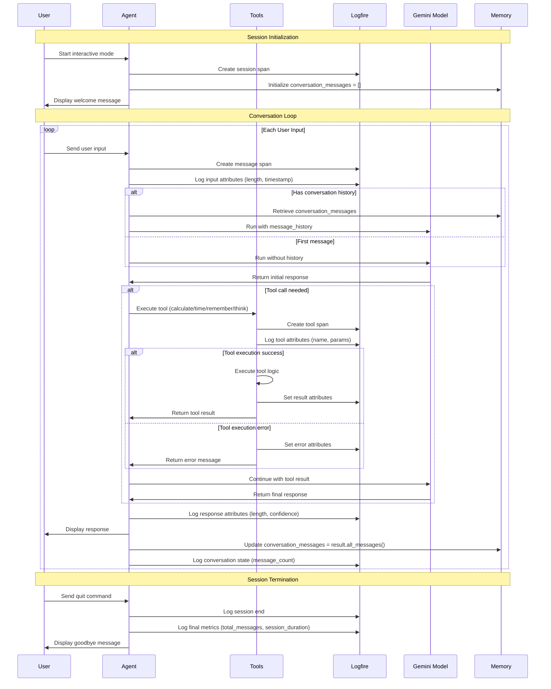
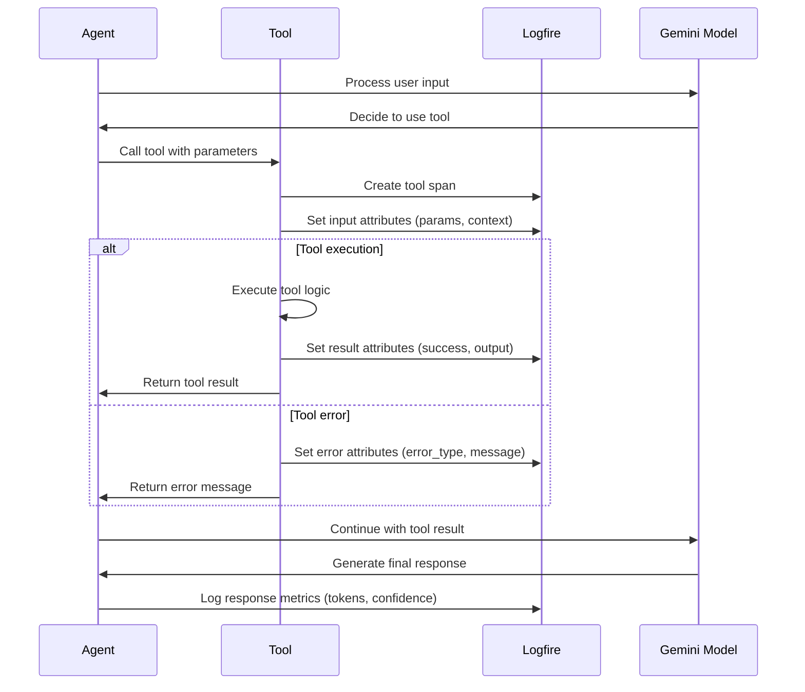
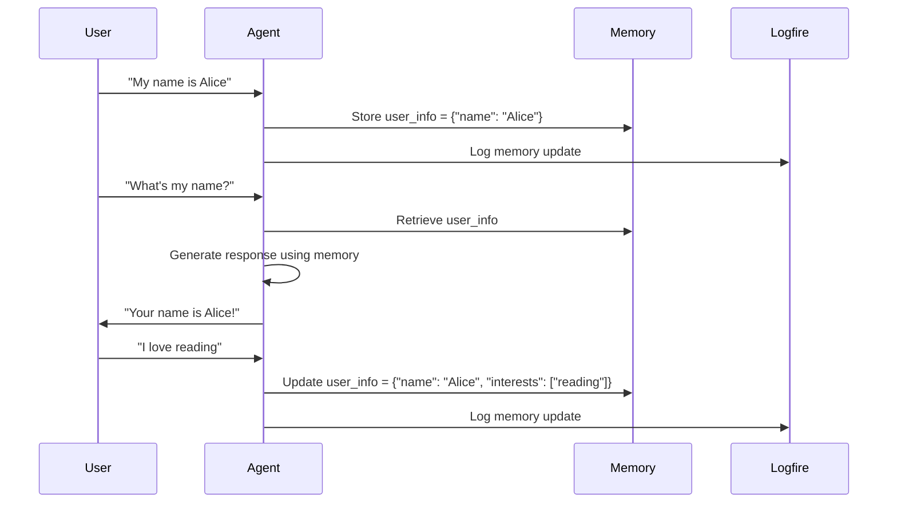
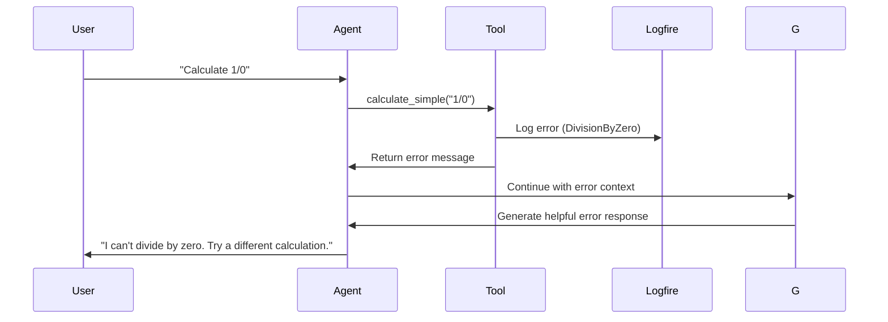

# General Chat Agent - Interactive Conversation Flow

## Overview
The General Chat Agent provides an interactive conversational experience with memory, tools, and comprehensive observability. This document shows the detailed flow of how the agent processes user input and maintains conversation context.

## Sequence Diagram

## Tool Execution Flow

## Memory Management Flow

## Key Components

### 1. Conversation Memory
- **Purpose**: Maintains context across the entire session
- **Implementation**: `conversation_messages` list containing all messages
- **Persistence**: In-memory during session, cleared on restart

### 2. User Memory
- **Purpose**: Stores user preferences and information
- **Implementation**: `user_info` dictionary
- **Tools**: `remember_user_info()` for storage, implicit retrieval

### 3. Tool Integration
- **Available Tools**:
  - `remember_user_info()`: Store user preferences
  - `get_current_time()`: Get current date/time
  - `calculate_simple()`: Basic mathematical operations
  - `get_thinking()`: Step-by-step problem analysis

### 4. Observability
- **Session Tracking**: Complete conversation flow
- **Tool Monitoring**: Execution times and success rates
- **Performance Metrics**: Response times, token usage
- **Error Tracking**: Tool failures and debugging info

## Error Handling

## Performance Considerations

1. **Memory Management**: Conversation history grows with session length
2. **Tool Latency**: External tools may add response time
3. **Token Usage**: Long conversations consume more tokens
4. **Error Recovery**: Graceful handling of tool failures

## Monitoring Metrics

- **Session Duration**: Total time from start to quit
- **Message Count**: Number of user inputs processed
- **Tool Usage**: Frequency and success rate of each tool
- **Response Times**: Average time to generate responses
- **Error Rates**: Percentage of failed tool executions 