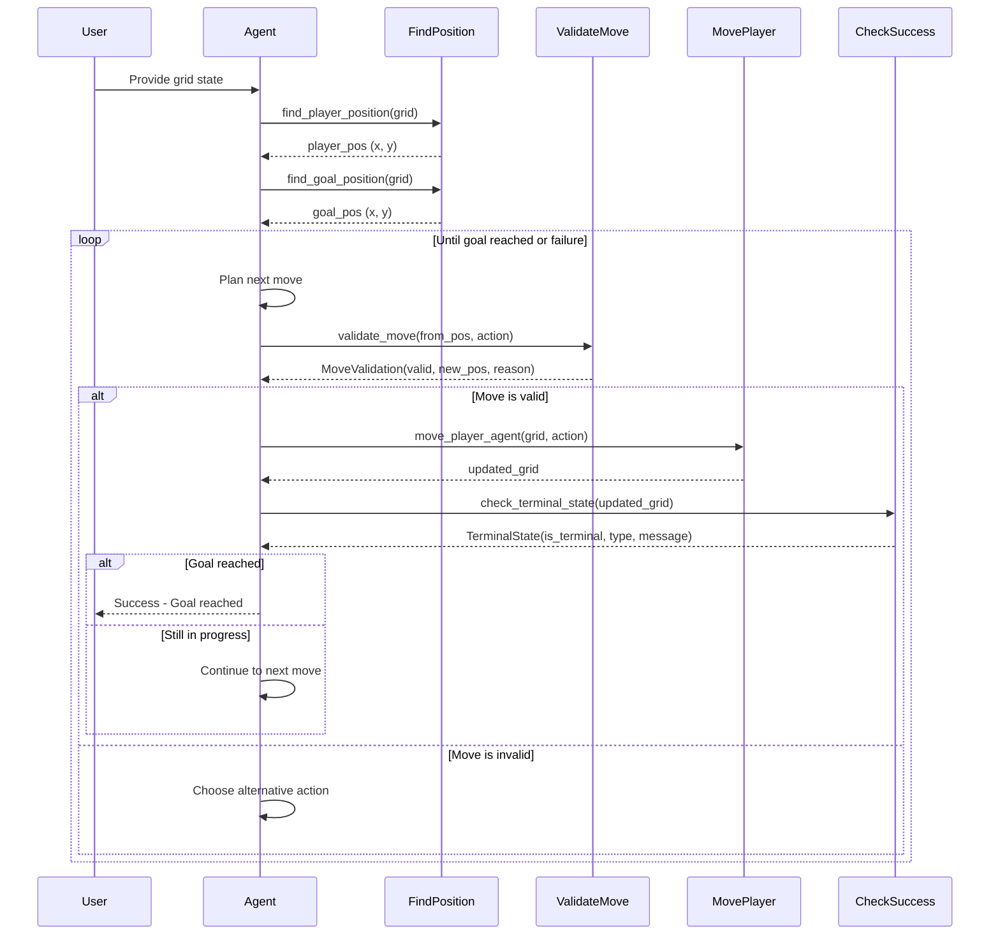
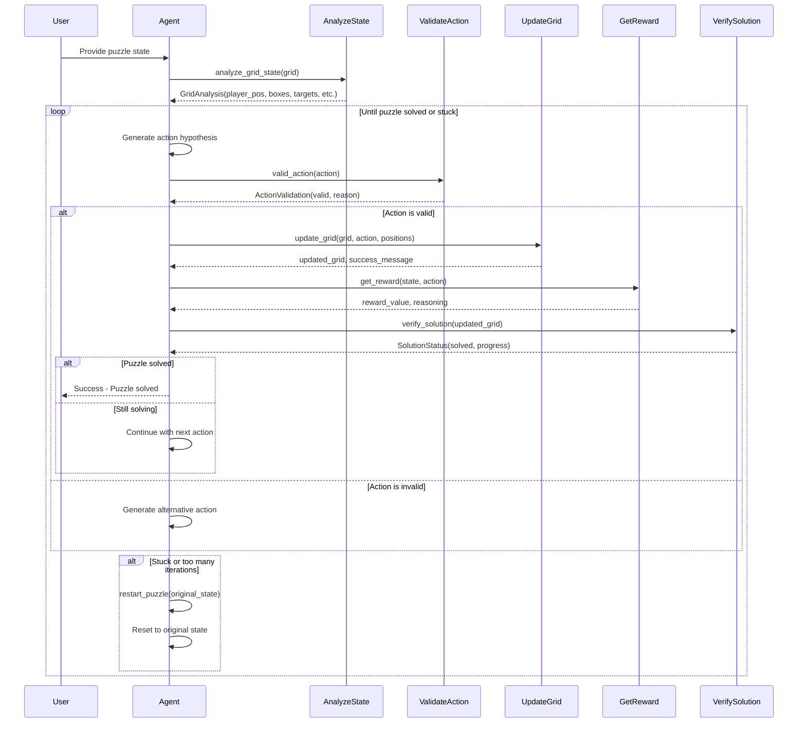
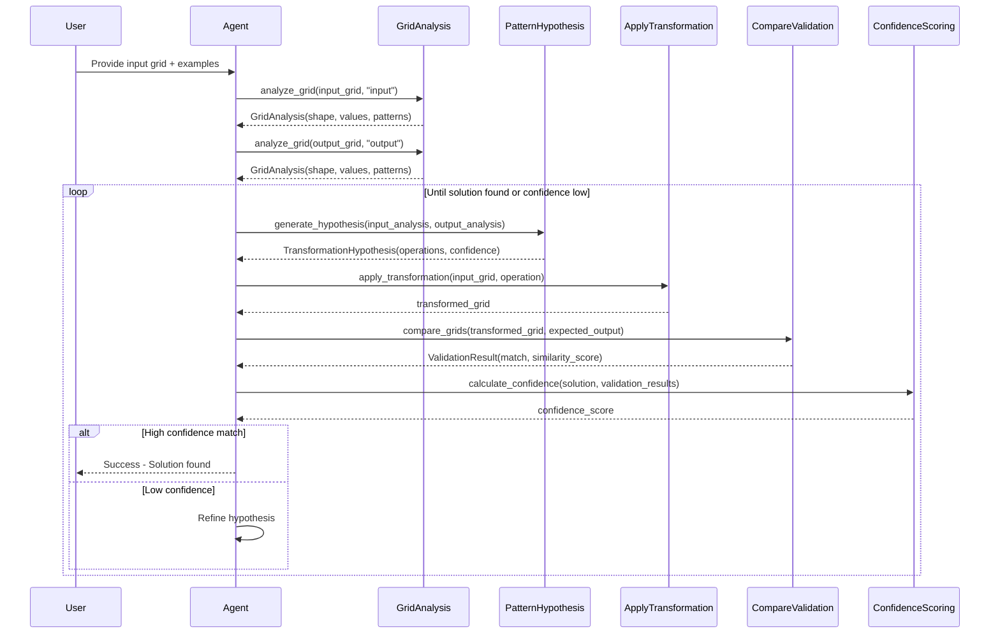
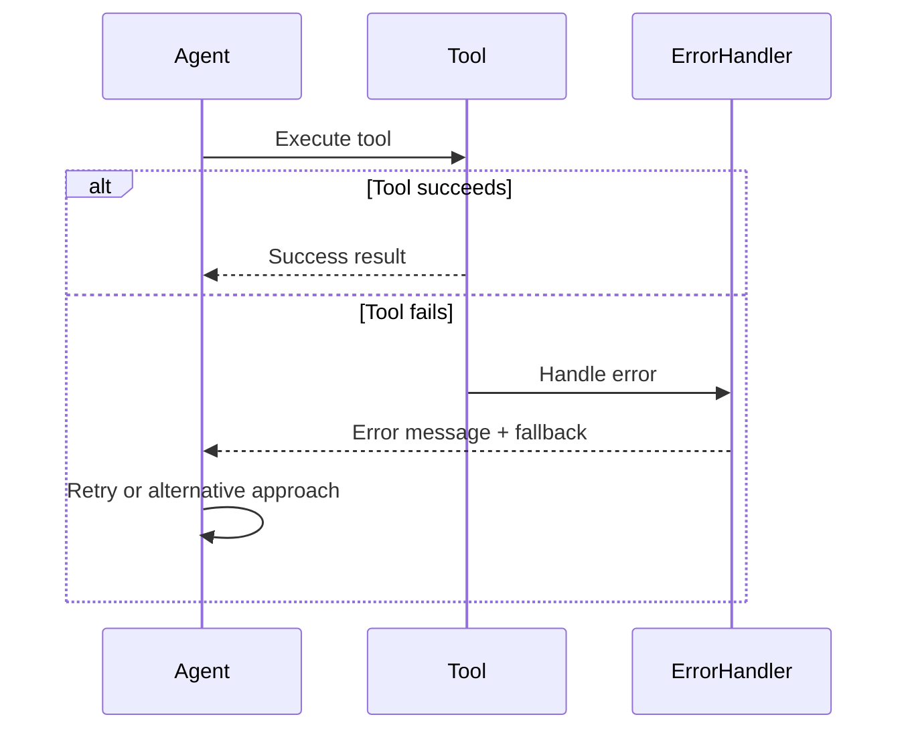
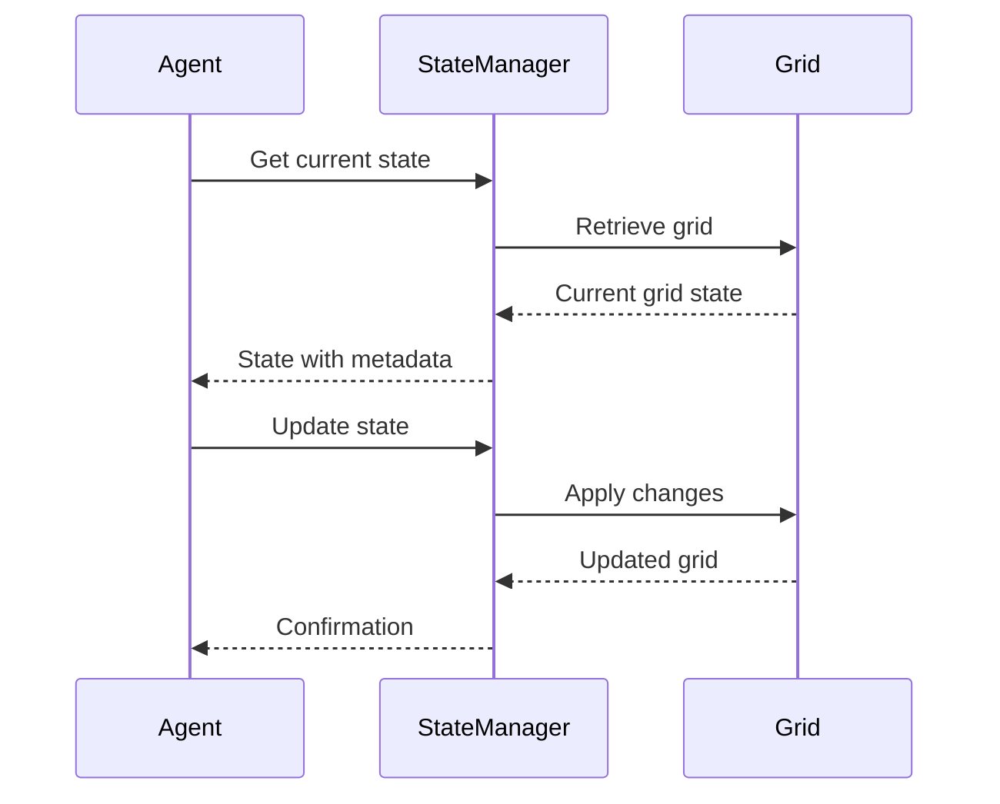
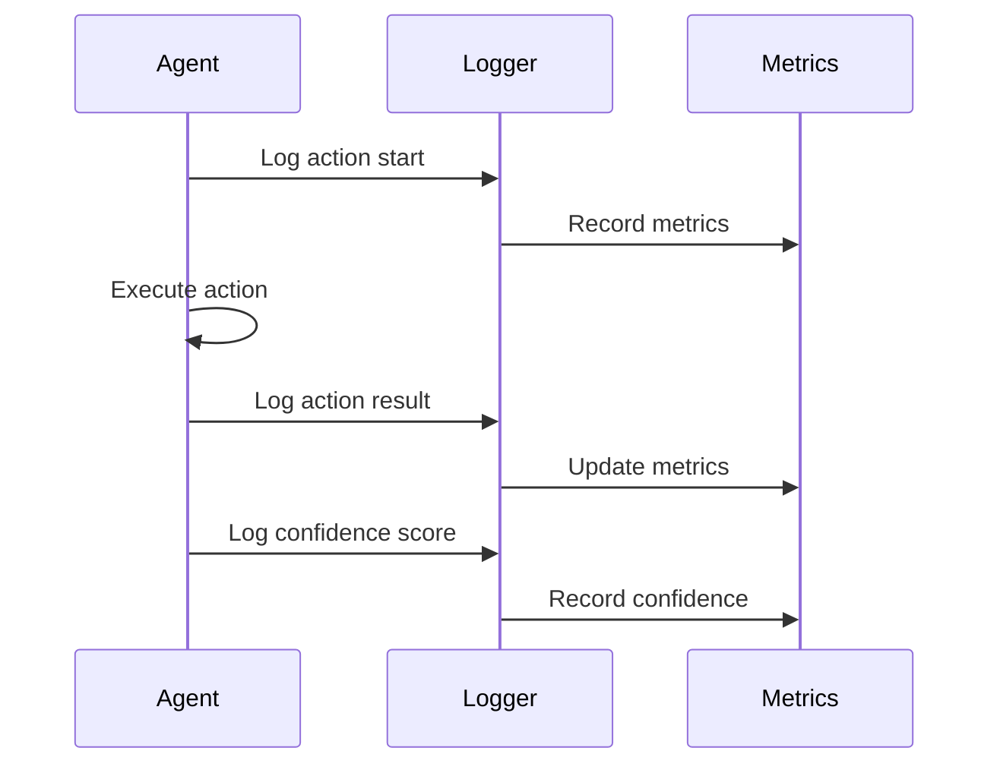

# Grid Game Patterns: Sequence Diagrams

This document provides sequence diagrams for the three main grid game patterns identified in the Small Agents project.

## Pattern 1: Navigation & Pathfinding (Frozen Lake Style)

### Overview
The navigation pattern focuses on moving an agent from a starting position to a goal while avoiding obstacles.

### Sequence Flow

### Key Interactions
1. **Position Discovery**: Agent finds current position and goal
2. **Move Planning**: Agent determines next action
3. **Validation**: System checks if move is legal and safe
4. **Execution**: Move is applied and grid updated
5. **Success Check**: System determines if goal reached

## Pattern 2: Puzzle Solving & State Transformation (Sokoban Style)

### Overview
The puzzle solving pattern focuses on transforming grid states according to game rules to achieve a solution.

### Sequence Flow

### Key Interactions
1. **State Analysis**: Agent understands current puzzle state
2. **Action Generation**: Agent proposes valid actions
3. **State Transformation**: Actions are applied to transform grid
4. **Reward Calculation**: System evaluates action quality
5. **Solution Verification**: Check if puzzle is solved
6. **Restart Mechanism**: Reset if stuck

## Pattern 3: Visual Reasoning & Pattern Recognition (ARC Style)

### Overview
The visual reasoning pattern focuses on identifying and applying transformations to solve visual puzzles.

### Sequence Flow

### Key Interactions
1. **Pattern Analysis**: Agent analyzes input and output grids
2. **Hypothesis Generation**: Agent proposes transformation operations
3. **Transformation Application**: Operations are applied to input grid
4. **Validation**: Result is compared with expected output
5. **Confidence Scoring**: System assesses solution reliability

## Common Patterns Across All Three

### Error Handling

### State Management

### Observability

## Pattern Selection Guide

### When to Use Navigation Pattern
- ✅ Agent needs to move from point A to point B
- ✅ Obstacles need to be avoided
- ✅ Goal is clearly defined
- ✅ State changes are simple (position updates)

### When to Use Puzzle Solving Pattern
- ✅ Complex game rules govern state changes
- ✅ Multiple objects interact (boxes, targets, etc.)
- ✅ Progress can be measured incrementally
- ✅ Restart capability is needed

### When to Use Visual Reasoning Pattern
- ✅ Input/output examples are provided
- ✅ Geometric transformations are involved
- ✅ Pattern recognition is required
- ✅ Confidence scoring is important

## Implementation Considerations

### Performance
- **Navigation**: Optimize for pathfinding algorithms
- **Puzzle**: Focus on state space exploration
- **Visual**: Prioritize pattern matching efficiency

### Memory Management
- **Navigation**: Minimal state tracking
- **Puzzle**: Deep copy grids for state transformations
- **Visual**: Cache pattern analysis results

### Error Recovery
- **Navigation**: Retry with alternative paths
- **Puzzle**: Restart from original state
- **Visual**: Refine hypotheses iteratively 