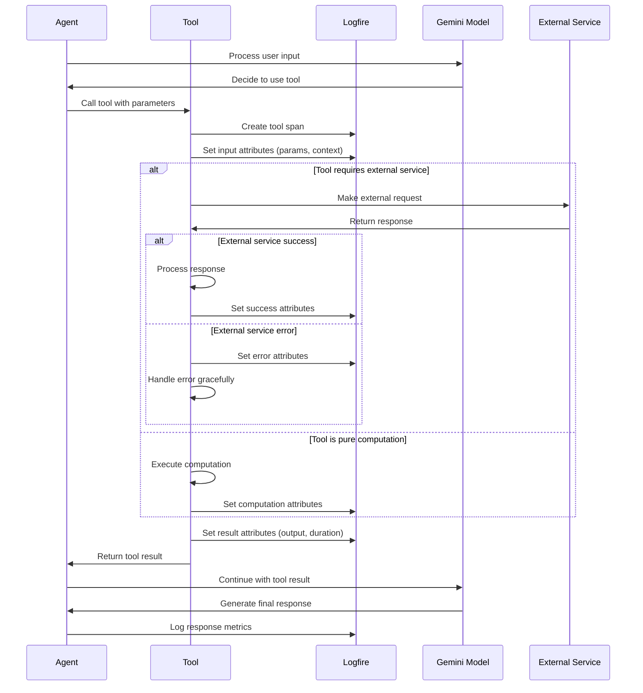
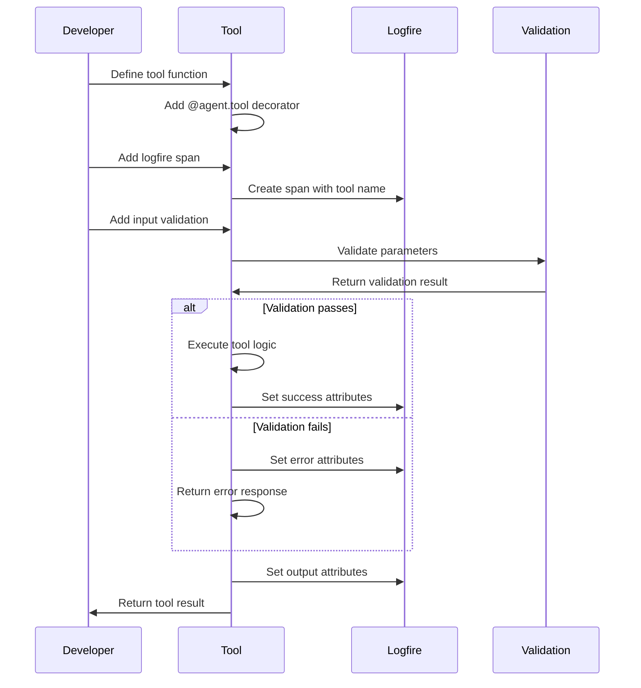
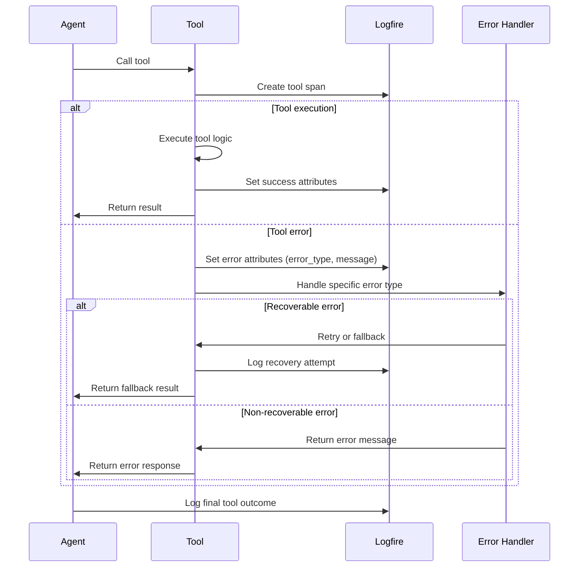
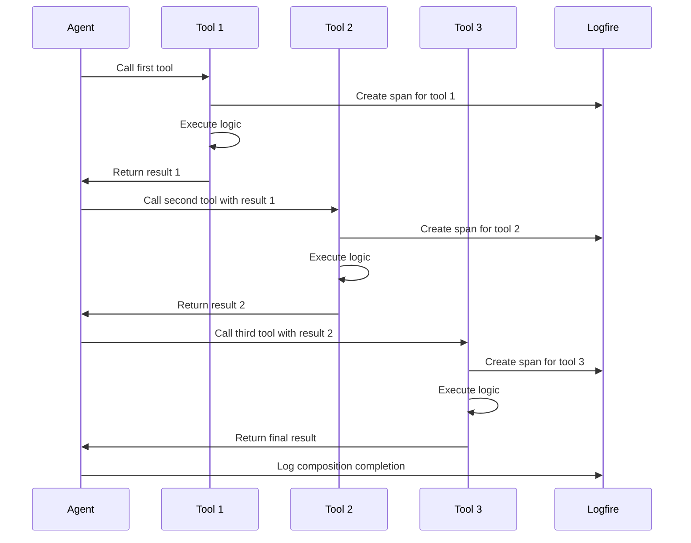
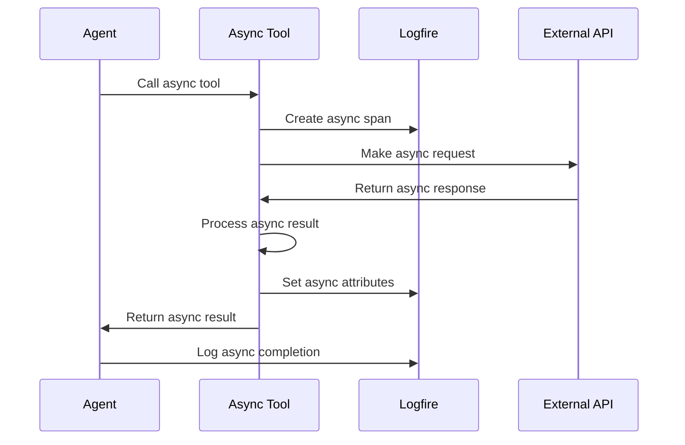
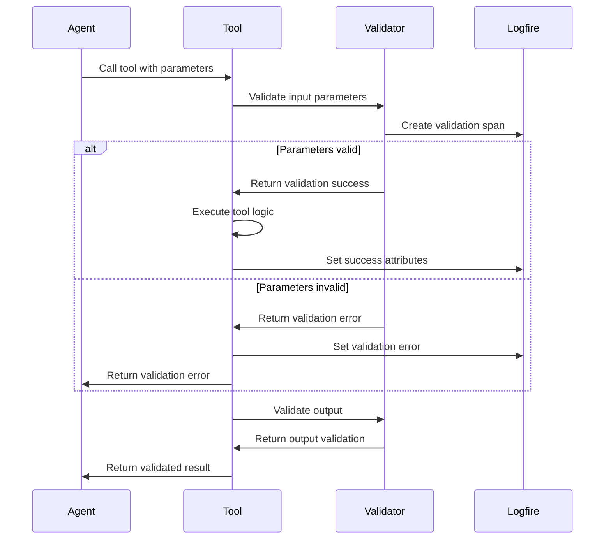

# Tool Execution Patterns

## Overview
This document describes the standard patterns for tool execution in the Small Agents framework. All tools follow a consistent pattern for observability, error handling, and integration with the agent system.

## Standard Tool Execution Flow



## Tool Definition Pattern



## Error Handling Pattern



## Tool Composition Pattern



## Async Tool Pattern



## Tool Validation Pattern



## Key Components

### 1. Tool Decorator
```python
@agent.tool
async def my_tool(ctx: RunContext, param: str) -> str:
    """Tool description for the agent."""
    with logfire.span("my_tool") as span:
        # Tool implementation
        span.set_attribute("param", param)
        result = process(param)
        span.set_attribute("result", result)
        return result
```

### 2. Logfire Integration
- **Automatic Spans**: Every tool call creates a span
- **Input Logging**: Parameters and context are logged
- **Output Logging**: Results and execution time are logged
- **Error Tracking**: Failures and error types are captured

### 3. Error Handling
- **Graceful Degradation**: Tools handle errors gracefully
- **Error Classification**: Distinguish between recoverable and fatal errors
- **Fallback Mechanisms**: Provide alternative results when possible
- **Error Reporting**: Clear error messages for debugging

### 4. Validation
- **Input Validation**: Check parameters before execution
- **Output Validation**: Verify results meet expectations
- **Type Safety**: Use Pydantic models for structured data
- **Constraint Checking**: Validate business rules and limits

## Common Tool Patterns

### 1. Data Fetching Tools
```python
@agent.tool
async def fetch_data(ctx: RunContext, url: str) -> Dict[str, Any]:
    """Fetch data from external API."""
    with logfire.span("fetch_data") as span:
        span.set_attribute("url", url)
        try:
            async with httpx.AsyncClient() as client:
                response = await client.get(url)
                response.raise_for_status()
                data = response.json()
                span.set_attribute("status_code", response.status_code)
                return data
        except Exception as e:
            span.set_attribute("error", str(e))
            raise
```

### 2. Computation Tools
```python
@agent.tool
async def calculate(ctx: RunContext, expression: str) -> float:
    """Evaluate mathematical expression."""
    with logfire.span("calculate") as span:
        span.set_attribute("expression", expression)
        try:
            result = eval(expression)  # In production, use safer eval
            span.set_attribute("result", result)
            return result
        except Exception as e:
            span.set_attribute("error", str(e))
            raise
```

### 3. State Management Tools
```python
@agent.tool
async def remember(ctx: RunContext, key: str, value: str) -> str:
    """Store information in memory."""
    with logfire.span("remember") as span:
        span.set_attribute("key", key)
        memory[key] = value
        span.set_attribute("memory_size", len(memory))
        return f"Remembered {key}: {value}"
```

## Performance Considerations

### 1. Tool Latency
- **External Calls**: Use async/await for I/O operations
- **Caching**: Cache frequently accessed data
- **Connection Pooling**: Reuse HTTP connections
- **Timeout Handling**: Set appropriate timeouts

### 2. Resource Management
- **Memory Usage**: Monitor memory consumption
- **Connection Limits**: Limit concurrent external calls
- **Rate Limiting**: Respect API rate limits
- **Cleanup**: Properly close resources

### 3. Monitoring
- **Execution Time**: Track tool performance
- **Success Rates**: Monitor tool reliability
- **Error Patterns**: Identify common failure modes
- **Resource Usage**: Track memory and CPU usage

## Best Practices

1. **Always use spans**: Every tool should create a logfire span
2. **Validate inputs**: Check parameters before processing
3. **Handle errors gracefully**: Provide meaningful error messages
4. **Log key metrics**: Track performance and success rates
5. **Use async when possible**: Improve responsiveness
6. **Document tools clearly**: Help the agent choose the right tool
7. **Test thoroughly**: Ensure tools work reliably
8. **Monitor performance**: Track and optimize slow tools 